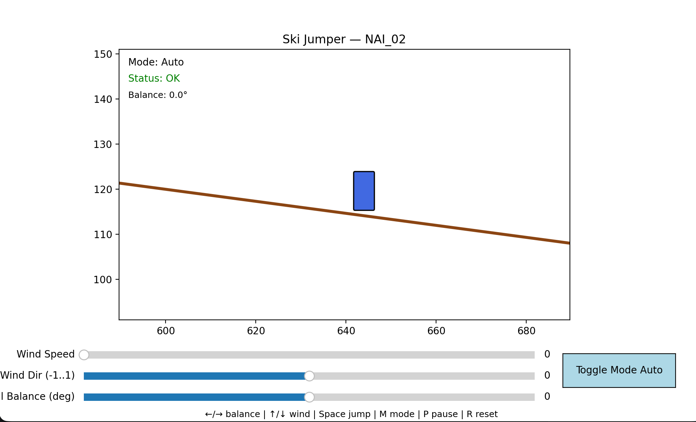
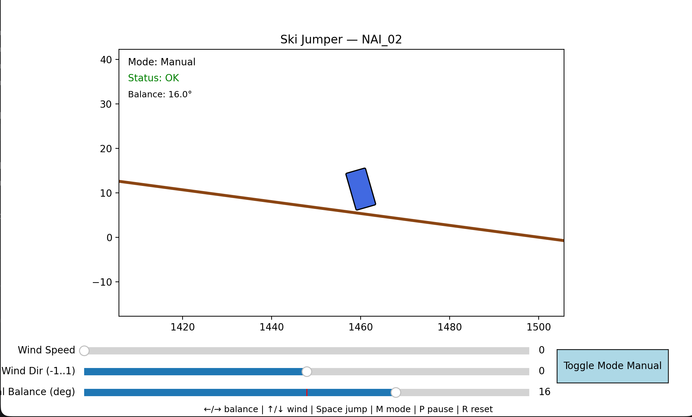
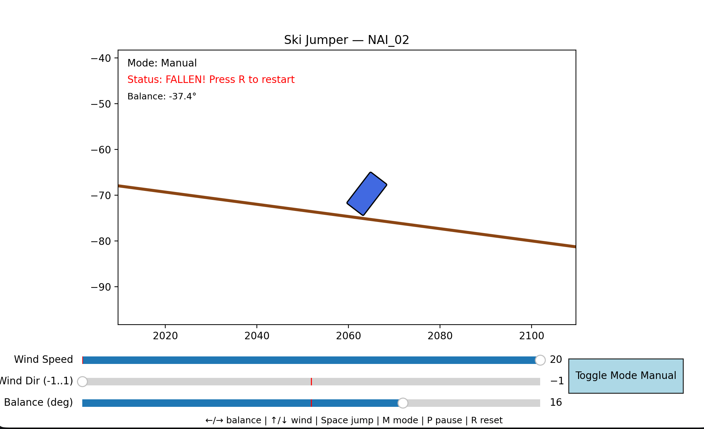
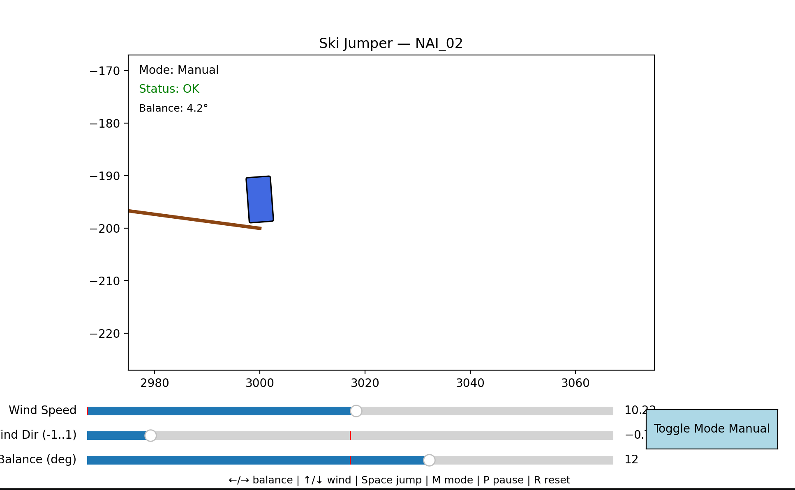
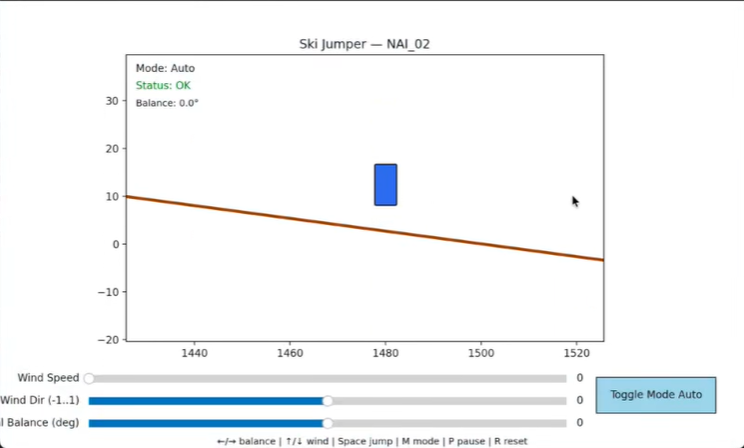

## Key features:
- Matplotlib-based animation (Qt5Agg backend)
- Simple rotational physics influenced by wind and a PID-like controller
- Two control modes: automatic (stabilizing) and manual (player sets desired lean)
- Collision detection via checking bottom corner points against the slope
- Widgets (sliders and a button) for runtime parameter tuning
- Keyboard controls: left/right (balance), up/down (wind), space (jump),
  M (toggle mode), P (pause), R (reset)

## Controls
- ← / → : manual balance (adjust Manual Balance slider)
- ↑ / ↓ : increase / decrease wind (adjust Wind Speed slider)
- Space : jump (if not fallen)
- M : toggle Auto / Manual mode
- P : pause
- R : reset!

