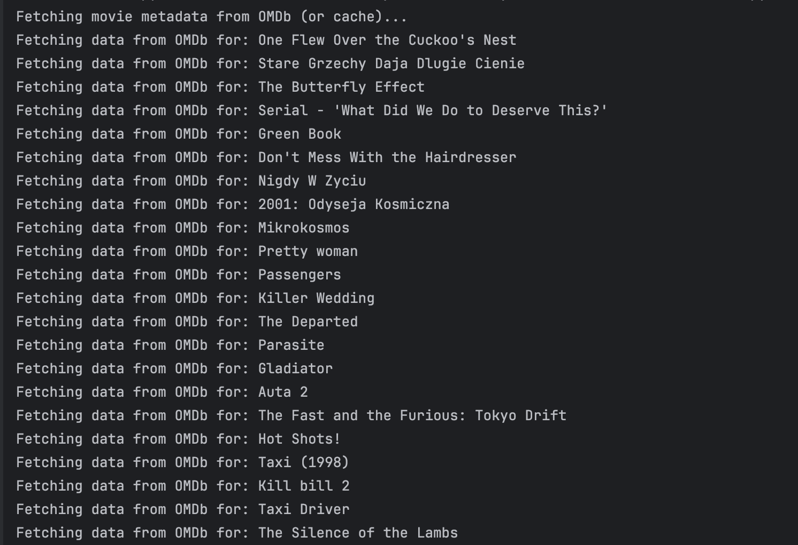
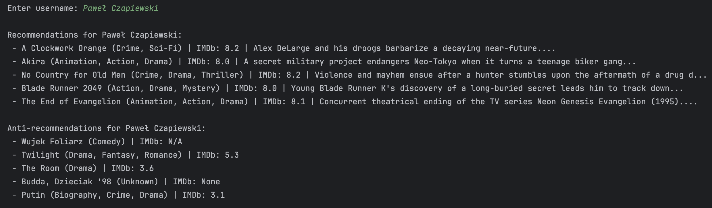
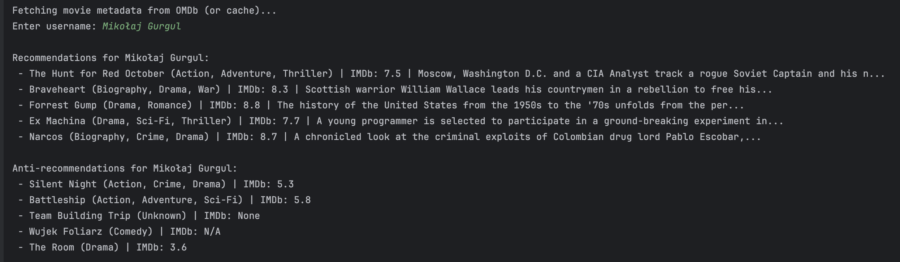
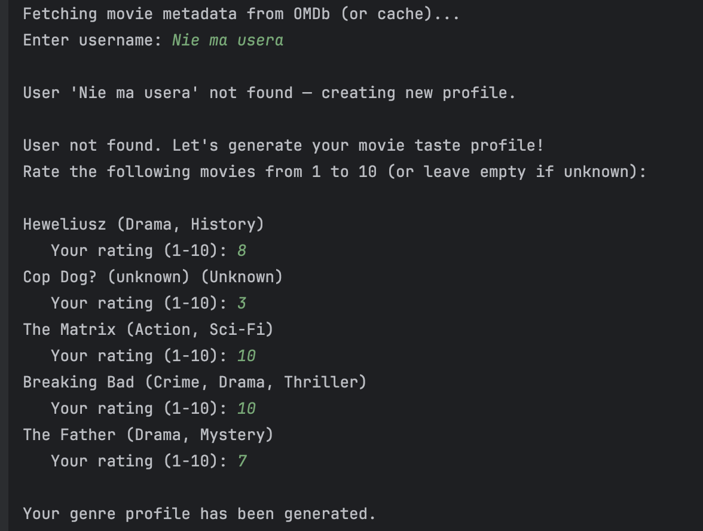
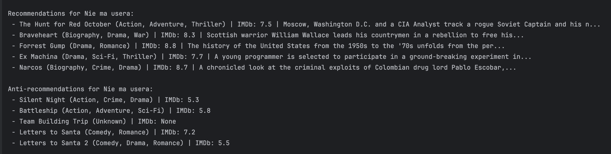

# Movie Recommender

This script provides personalized movie recommendations and anti-recommendations using **fuzzy genre-based scoring**. It fetches movie metadata from **OMDb** (with caching), builds user profiles from ratings, and supports creating new profiles interactively.

---

## Key Features
- Loads user ratings from a JSON file (`ratings_en.json`)
- Fetches movie metadata (genre, IMDb rating, plot) from **OMDb** with caching
- Builds **genre-based user profiles** with fuzzy scoring
- Supports **existing and new users** (interactive profile creation)
- Generates **recommendations** (movies you may like) and **anti-recommendations** (movies to avoid)
- Uses **IMDb rating** and genre matching for smarter suggestions
- Fully **command-line based** (no GUI needed)
- Modular, easy to extend for additional scoring factors (director, actors, etc.)

---

## Usage after run
- Open the code with instruction
- Write username to get recommendations
- If there's no user in file code will ask a few questions for recommendations

Fetching movies from API at the start of the program

Recommendations

If there's a cache, there's no need to fetching from API

If there's no user in the ratings_en.json file there are a few questions to user

And recommendations based on his answers

