This script performs classification tasks on two datasets:

1. **Wine Quality Prediction**
   - Predicts whether wine is of "good" or "bad" quality.
   - Uses Decision Tree and SVM classifiers.
   - Performs kernel comparison: linear, polynomial, rbf, sigmoid.
   - Generates example predictions (assignment requirement).
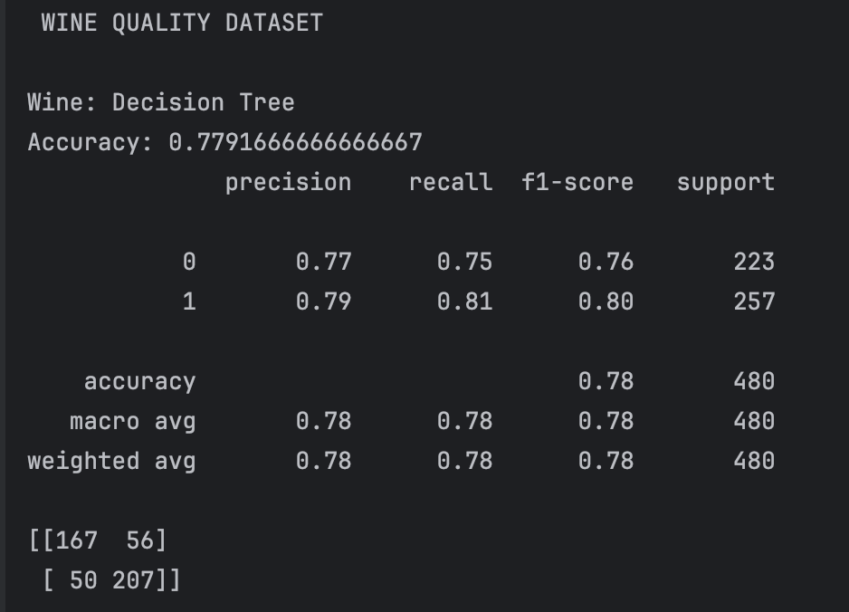
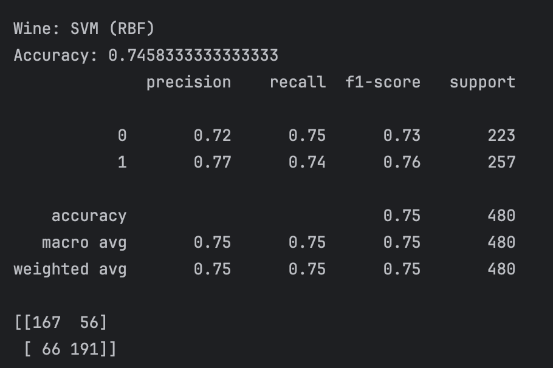
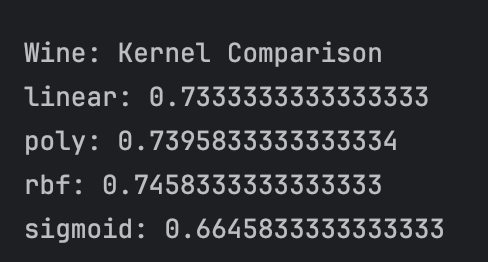
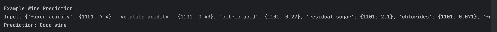
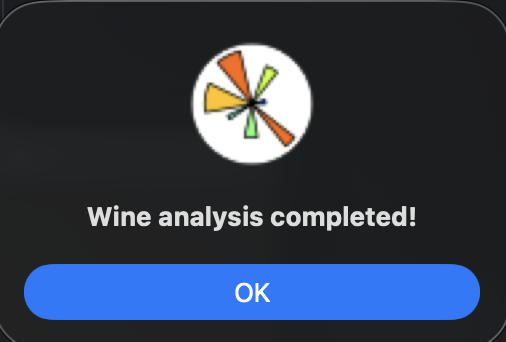

2. **Drug Effectiveness Prediction**
   - Predicts whether a patient improved after taking a medication.
   - Includes feature engineering and one-hot encoding.
   - Supports the same ML models as the wine dataset.
   - Also includes example prediction.
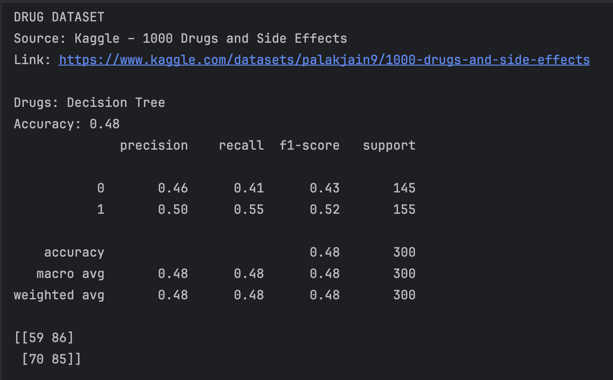
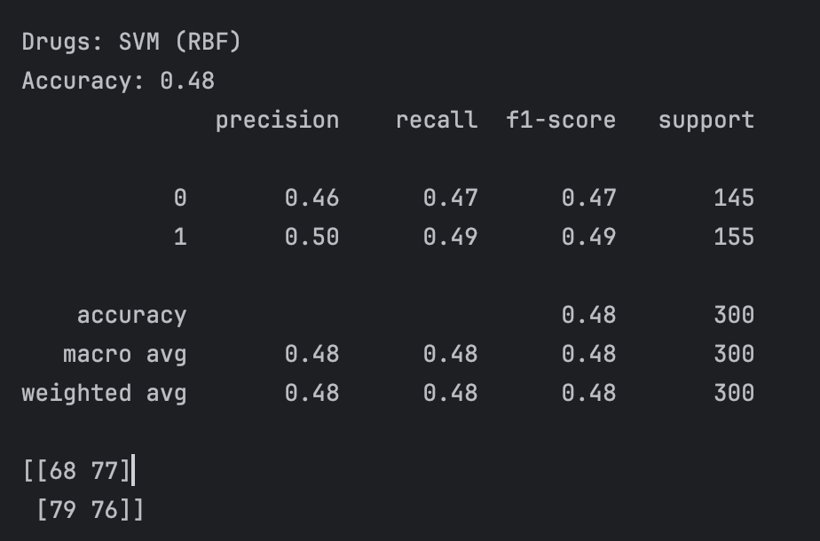
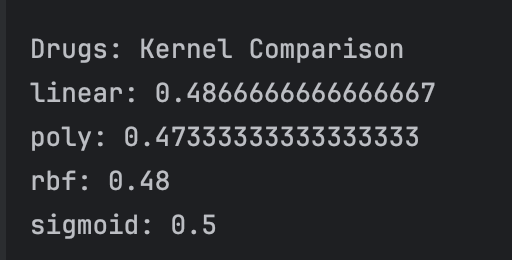
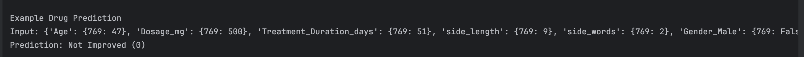
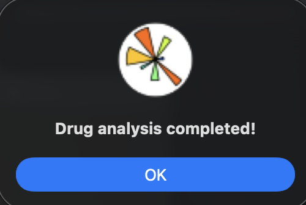

3. **Visualization**
   - Histograms for numeric features.
   - Heatmap for feature correlations.

**Wine**

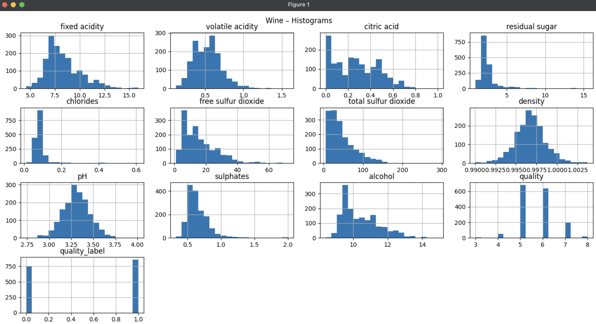
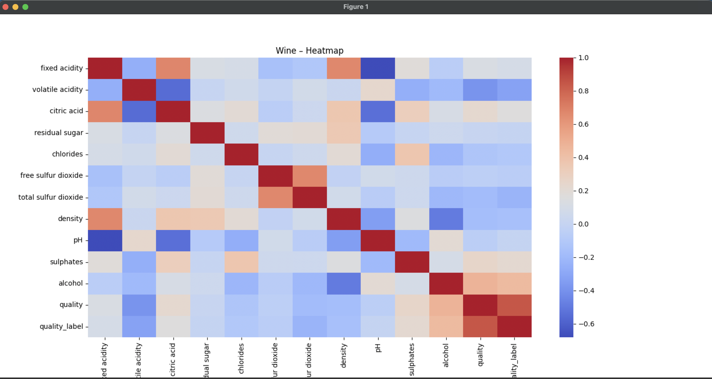

**Drug**

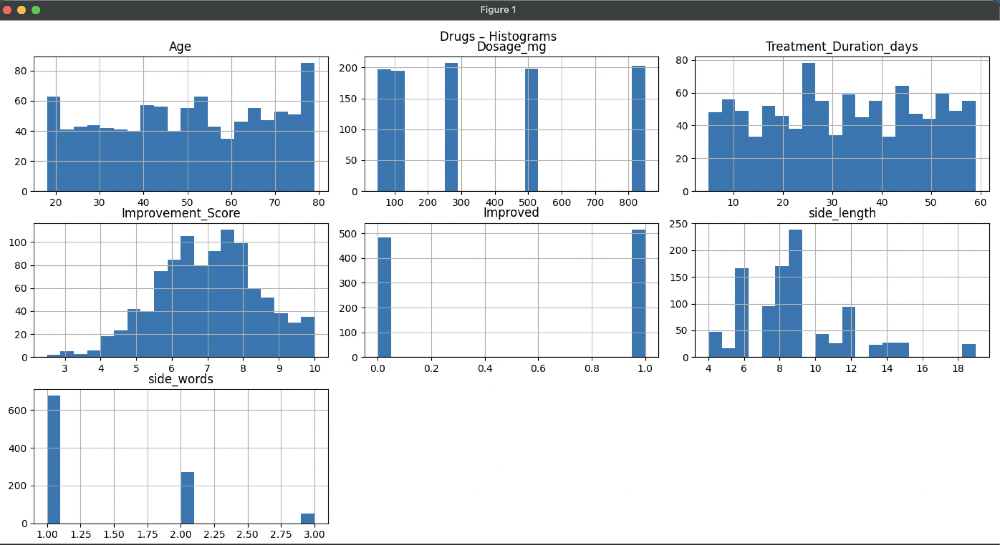
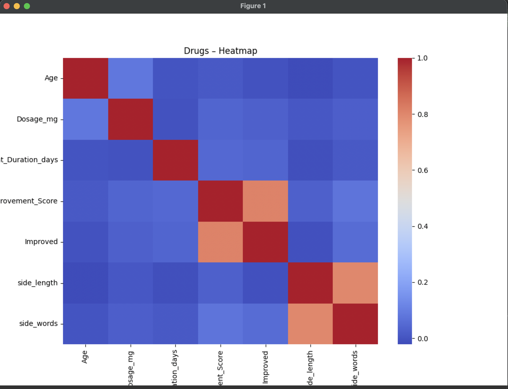

4. **GUI (Tkinter)**
   - User-friendly interface to run analysis.
   - Displays kernel function summary.

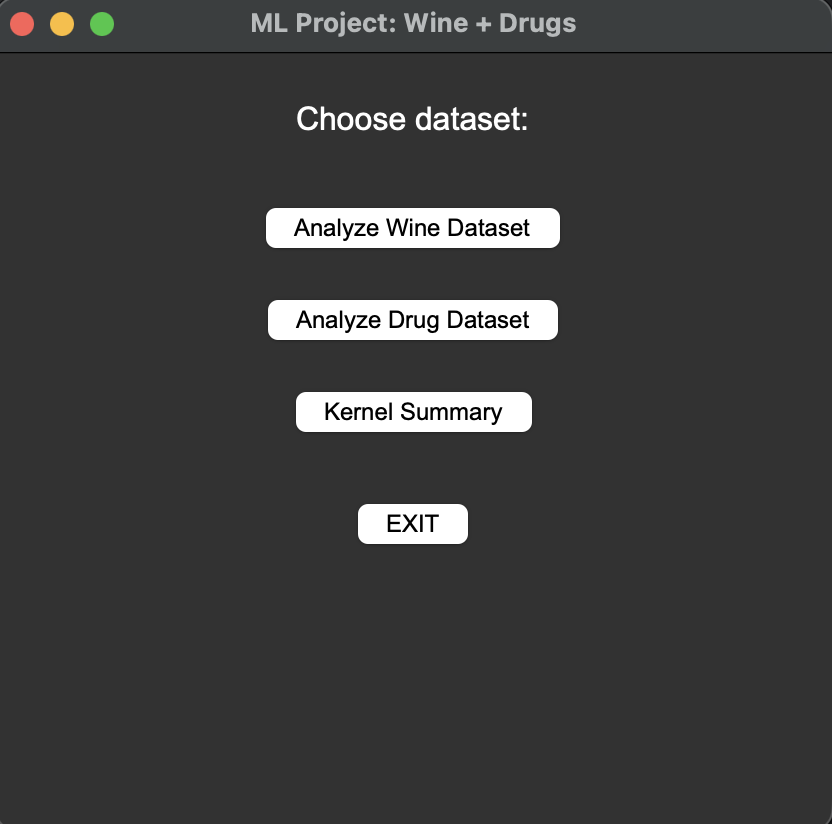

This project demonstrates SVM behaviour under different kernel functions:

- Linear kernel — linearly separable decision boundaries.
- Polynomial — nonlinear mapping with controllable degree.
- RBF — Gaussian kernel; flexible, smooth nonlinear boundaries.
- Sigmoid — behaves similarly to shallow neural networks.

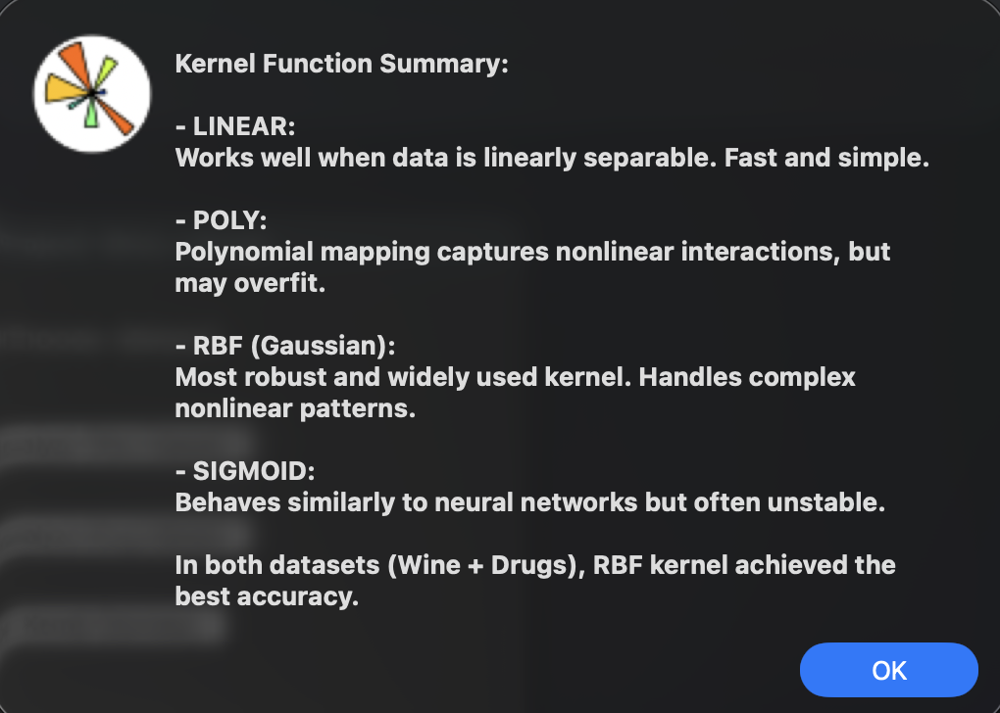